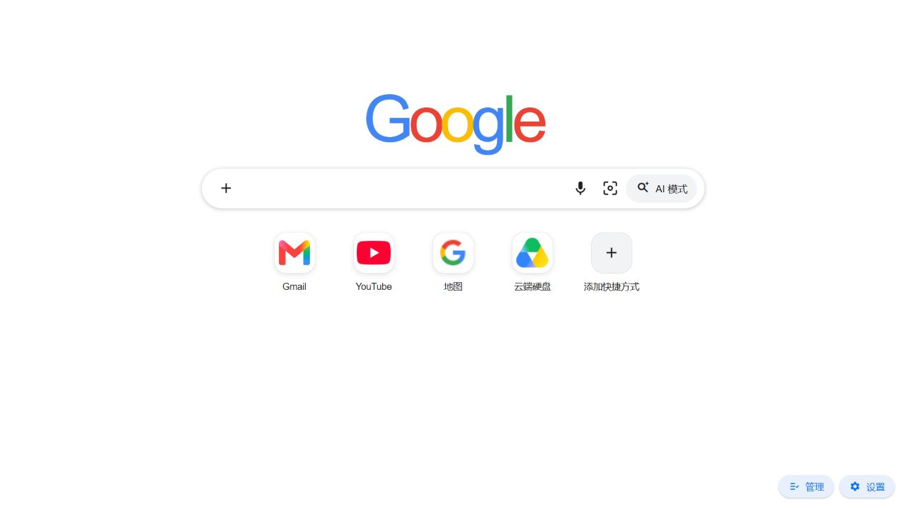
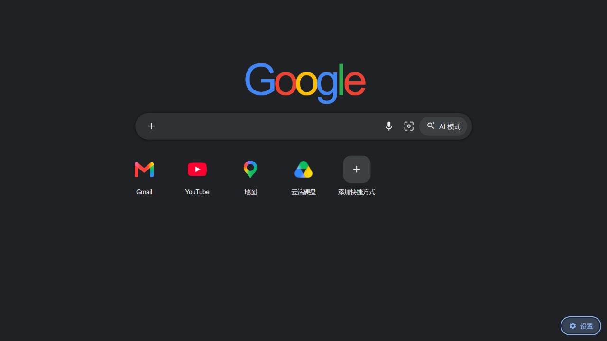
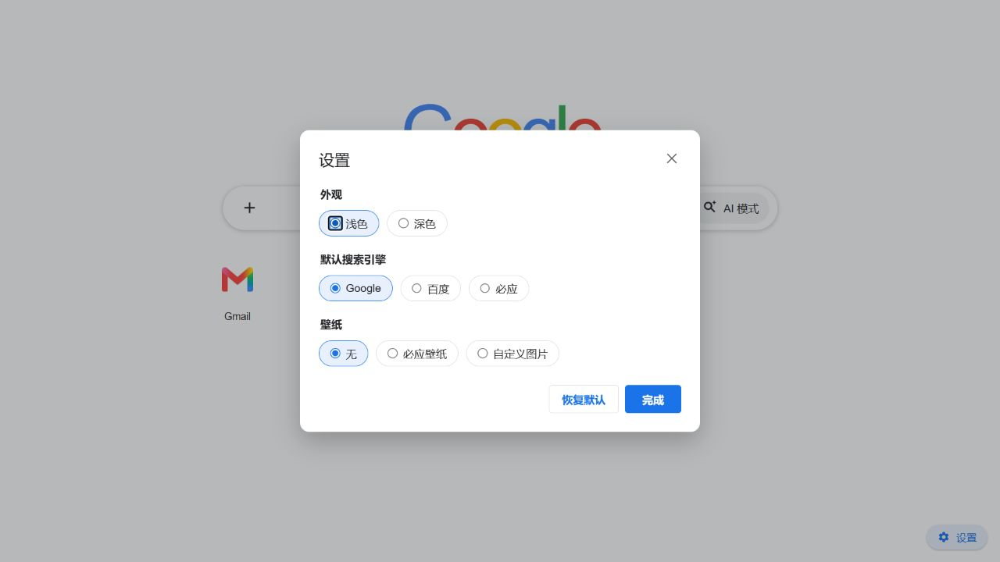

<div align="center">

# 微光新标签页 LumoraTab

一个简洁、快速、可自定义的 Chrome / Edge 新标签页扩展。

[](https://github.com/DBAA-LCT/lumoratab/releases/latest)
[](manifest.json)
[](#安装)
[](#安装)



</div>

## 亮点

- **熟悉且克制的界面**：现代浏览器新标签页风格，无框架、无运行时依赖。
- **多搜索引擎**：支持 Google、百度、Bing，提供搜索建议、网址直达和图片搜索入口。
- **灵活的快捷方式**：添加、编辑、删除和分组；可从收藏夹与常用网站中选择。
- **可靠的站点图标**：优先读取浏览器本地 favicon，并缓存已解析的图标来源。
- **个性化外观**：浅色/深色主题、必应每日壁纸、自定义图片和壁纸轮换。
- **本地保存**：快捷方式、主题和设置保存在 `chrome.storage.local`，无需注册账户。
- **跨浏览器**：基于 Manifest V3，同时支持 Google Chrome 与 Microsoft Edge。

## 界面预览

| 深色主题 | 设置面板 |
| --- | --- |
|  |  |

## 安装

前往 [GitHub Releases](https://github.com/DBAA-LCT/lumoratab/releases/latest) 下载最新版：

| 文件 | 用途 |
| --- | --- |
| `lumoratab-v<版本>.crx` | 签名 CRX3 包，适合发布、企业策略部署及保留稳定扩展 ID |
| `lumoratab-chrome-v<版本>.zip` | Chrome 开发者模式安装包 |
| `lumoratab-edge-v<版本>.zip` | Edge 开发者模式安装包 |
| `SHA256SUMS.txt` | 发布文件完整性校验 |

### 使用 ZIP 安装（推荐个人使用）

Windows 和 macOS 上的 Chrome / Edge 通常不允许普通用户直接安装非商店来源的 CRX。个人使用建议：

1. 下载并解压对应的 ZIP。
2. Chrome 打开 `chrome://extensions/`；Edge 打开 `edge://extensions/`。
3. 开启“开发者模式”。
4. 点击“加载已解压的扩展程序”。
5. 选择能直接看到 `manifest.json` 的解压目录，然后打开一个新标签页。

## 功能说明

### 搜索

- 点击彩色搜索引擎名称可切换 Google、百度或 Bing。
- 输入关键词后直接搜索；输入网址则直接访问。
- 支持搜索建议、语音搜索入口、图片搜索入口和 AI 搜索入口。

### 快捷方式

- 添加、编辑、移除或分组管理常用网站。
- 支持读取浏览器收藏夹与 `topSites` 常用网站。
- 自动获取并缓存网站 favicon，减少新标签页重复请求。

### 外观与壁纸

- 浅色与深色主题。
- 必应每日壁纸、手动切换和自动轮换。
- 自定义本地图片作为背景。
- 壁纸模式下自动启用液态玻璃风格快捷方式。

## 权限与数据

| 权限 | 用途 |
| --- | --- |
| `bookmarks` | 搜索收藏夹并将网站添加为快捷方式 |
| `favicon` | 显示浏览器保存的网站图标 |
| `storage` / `unlimitedStorage` | 保存设置、快捷方式和自定义壁纸 |
| `topSites` | 读取浏览器常用网站供用户选择 |
| 搜索建议与 Bing 域名访问 | 获取搜索建议和必应壁纸 |

项目不要求登录账户。用户配置保存在浏览器本地；搜索建议、站点图标和壁纸功能会按需请求对应的第三方服务。完整说明见 [`store/privacy-policy.md`](store/privacy-policy.md)。

## 从源码开发

本项目没有 npm 依赖，也不需要前端编译：

```bash
git clone https://github.com/DBAA-LCT/lumoratab.git
cd lumoratab
```

然后在扩展管理页开启开发者模式，选择“加载已解压的扩展程序”，并加载仓库根目录。修改 HTML、CSS 或 JavaScript 后，在扩展管理页点击“重新加载”。

仓库以 `main` 作为唯一长期开发分支。日常开发提交到 `main`，发布时从 `main` 创建与 `manifest.json` 版本一致的 `v*` 标签，不再维护长期 `release/*` 分支。

### Edge 独立预览

Windows 下双击 `preview-edge-dev.cmd`，脚本会使用独立的 Edge 用户资料启动开发窗口，避免影响日常浏览器数据。首次使用时按提示加载仓库根目录即可。

## 构建与发布

生成 Chrome、Edge ZIP 和 SHA-256 校验文件：

```powershell
.\build-release.ps1
```

使用固定 PEM 私钥同时生成签名 CRX3：

```powershell
python .\build-release.py --crx-key C:\安全目录\lumoratab.pem --require-crx
```

私钥必须安全保存并在后续版本中复用，否则扩展 ID 会改变。不要把 `.pem` 文件提交到 Git。

仓库已配置 GitHub Actions：推送与 `manifest.json` 版本一致的 `v*` 标签后，会自动生成并上传 CRX、ZIP 和 `SHA256SUMS.txt`。签名私钥以 Base64 形式保存在 `CRX_PRIVATE_KEY_B64` Actions Secret 中。

## 项目结构

```text
lumoratab/
├── manifest.json              # Manifest V3 配置与权限
├── newtab.html                # 页面结构与对话框
├── newtab.css                 # 界面、主题和响应式样式
├── newtab.js                  # 搜索、快捷方式、壁纸与设置逻辑
├── docs/screenshots/          # README 界面截图
├── store/                     # 商店文案、隐私政策与提交材料
├── build-release.py           # ZIP / CRX 发布构建脚本
├── build-release.ps1          # PowerShell 构建入口
├── preview-edge-dev.cmd       # Edge 开发预览入口
└── .github/workflows/         # 自动发布工作流
```

## 为什么采用独立实现

Chromium 源码是开源的，但浏览器内置新标签页并不是可独立安装的扩展。它依赖 Chromium 内部的 WebUI、C++ / Mojo 接口和浏览器服务；Google Chrome 版本还包含品牌与在线服务组件。

LumoraTab 因此采用轻量的独立实现，不复制庞大的 Chromium 源码，也不依赖来源不明的第三方新标签页代码。

## 商标说明

Google、Chrome、Microsoft、Edge、Bing 等名称和标识属于其各自权利人。本项目与上述公司无隶属或官方合作关系。若将分支版本发布到浏览器扩展商店，建议使用自有名称与视觉标识，避免让用户误认为是官方产品。
