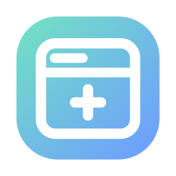
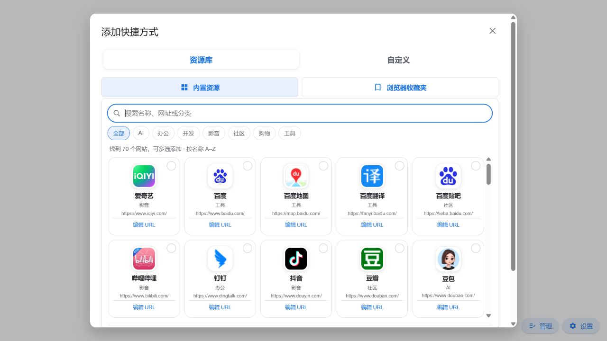

<div align="center">



<h1>微光新标签页 LumoraTab</h1>

<p>一个简洁、快速、可自定义的 Chrome / Edge 新标签页扩展。</p>

<p>
  <a href="https://github.com/DBAA-LCT/lumoratab/releases/latest"></a>
  <a href="manifest.json"></a>
  <a href="#安装"></a>
  <a href="#安装"></a>
</p>


</div>

## 亮点

- **熟悉且克制的界面**：现代浏览器新标签页风格，无框架、无运行时依赖。
- **搜索与 AI 提问**：支持 Google、百度、Bing、搜狗和 360 搜索，可分别设置默认引擎和花瓣中显示的引擎；还可把纯文字问题直接转发到豆包或 DeepSeek 网页端。
- **灵活的快捷方式**：添加、编辑、批量删除、跨页移动、拖动排序和分组；支持隐藏或设置 1–3 行上限，并用分页圆点快速跳转。
- **清晰且可控的站点图标**：正常使用时仍按自动优先级选择站点自身图标和浏览器 favicon；用户点击“更改图标”后，可在自动结果、手动获取、图片网址和本地上传候选中选择最终图标。
- **个性化外观**：浅色/深色主题、必应每日壁纸、自定义图片和壁纸轮换。
- **本地保存**：快捷方式、主题和设置保存在 `chrome.storage.local`，无需注册账户。
- **配置同步**：把快捷方式、搜索、外观、AI 选项和本地图片导出为 JSON，并在其他设备导入恢复。
- **隐私与反馈入口**：设置中提供完整隐私政策，以及报告问题和提出需求的 GitHub 入口。
- **跨浏览器**：基于 Manifest V3，同时支持 Google Chrome 与 Microsoft Edge。

## 界面预览

以下截图使用干净浏览器配置生成；界面细节可能随版本迭代调整。

| 快捷方式资源库 | 设置面板 |
| --- | --- |
|  |  |

## 安装

前往 [GitHub Releases](https://github.com/DBAA-LCT/lumoratab/releases/latest) 下载最新版：

| 文件 | 用途 |
| --- | --- |
| `lumoratab-v<版本>.crx` | 签名 CRX3 包，适合发布、企业策略部署及保留稳定扩展 ID |
| `lumoratab-chrome-v<版本>.zip` | Chrome 开发者模式安装包 |
| `lumoratab-edge-v<版本>.zip` | Edge 开发者模式安装包 |
| `SHA256SUMS.txt` | 发布文件完整性校验 |

### 使用 ZIP 安装（推荐个人使用）

Windows 和 macOS 上的 Chrome / Edge 通常不允许普通用户直接安装非商店来源的 CRX。个人使用建议：

1. 下载并解压对应的 ZIP。
2. Chrome 打开 `chrome://extensions/`；Edge 打开 `edge://extensions/`。
3. 开启“开发者模式”。
4. 点击“加载已解压的扩展程序”。
5. 选择能直接看到 `manifest.json` 的解压目录，然后打开一个新标签页。

## 功能说明

### 搜索

- 点击彩色搜索引擎名称可临时切换引擎，不会改动默认值；默认引擎和花瓣显示项只在设置中修改。
- 输入关键词后直接搜索；输入网址则直接访问。
- 点击历史记录时始终使用当前引擎，AI 引擎不显示输入联想，也不保存或显示搜索历史。
- 支持搜索建议、语音搜索入口、图片搜索入口和 AI 搜索入口。
- 选择豆包或 DeepSeek 后，可使用与聊天网站一致的多行输入框：Enter 发送、Shift+Enter 换行；DeepSeek 还可选择“深度思考”和“联网搜索”。扩展会打开对应网页、应用可识别的 DeepSeek 选项、填写并发送问题；待网页确认发送后才清除会话任务，登录或页面加载较慢时不会提前丢失。

### 快捷方式

- 添加、编辑、移除或分组管理常用网站。
- 支持拖动排序；拖到快捷方式边缘调整顺序，拖到中央创建或加入文件夹。
- 文件夹至少包含一个快捷方式；最后一个项目移出或删除后会自动清理文件夹。
- “添加快捷方式”分为“资源库 / 自定义”；资源库内含“内置资源 / 浏览器收藏夹”两个标签页。
- 内置 70 个 AI、办公、开发、影音、社区、购物和工具网站，以图标网格按名称 A–Z 展示并支持多选批量添加。
- 资源卡会显示具体网址；URL 编辑窗口分开显示只读的默认 URL 与可修改的自定义 URL，也可随时恢复默认值。
- 主页支持进入批量管理模式，一次选择并删除多个快捷方式或文件夹。
- 多页快捷方式支持上一页/下一页菜单移动；分页区域提供明确的上一页、下一页按钮，也可以点击圆点直接跳页。
- 可在设置中隐藏快捷方式，或选择最多显示 1、2、3 行；较小窗口仍会自动减少行数。
- 支持读取浏览器收藏夹与 `topSites` 常用网站。
- 自动探测网站自身的 SVG、Apple Touch Icon、高清 PNG 和浏览器 favicon；只有用户主动更改图标时，才展示自动结果并允许继续加入手动获取、图片网址和本地上传候选。手动结果不会覆盖自动缓存。已解析来源会缓存 30 天；满足跨域与大小条件的图片会直接保存为本地数据，其他图片继续使用浏览器 HTTP/favicon 缓存。

### 外观与壁纸

- 浅色与深色主题。
- 必应每日壁纸、手动切换和自动轮换。
- 自定义本地图片作为背景。
- 图标使用清晰的实色底，不再叠加整块快捷方式卡片；壁纸模式下通过文字阴影保持可读性。

## 权限与数据

| 权限 | 用途 |
| --- | --- |
| `bookmarks`（可选） | 仅在用户打开收藏夹选择器时申请，用于搜索收藏夹并添加快捷方式 |
| `favicon` | 显示浏览器保存的网站图标 |
| `storage` / `unlimitedStorage` | 保存设置、快捷方式和自定义壁纸 |
| `topSites` | 读取浏览器常用网站供用户选择 |
| 搜索建议与 Bing 域名访问 | 获取搜索建议和必应壁纸 |
| 豆包与 DeepSeek 网页访问 | 在用户主动提问后应用可识别的 AI 选项、填写纯文字问题并发送 |

项目不要求登录账户。用户配置保存在浏览器本地；搜索建议、壁纸和用户明确启用或手动触发的第三方图标功能会按需请求对应服务。完整说明见 [`store/privacy-policy.md`](store/privacy-policy.md)。

## 从源码开发

本项目没有 npm 依赖，也不需要前端编译：

```bash
git clone https://github.com/DBAA-LCT/lumoratab.git
cd lumoratab
```

然后在扩展管理页开启开发者模式，选择“加载已解压的扩展程序”，并加载仓库根目录。修改 HTML、CSS 或 JavaScript 后，在扩展管理页点击“重新加载”。

仓库以 `main` 作为唯一长期开发分支。日常开发提交到 `main`，发布时从 `main` 创建与 `manifest.json` 版本一致的 `v*` 标签，不再维护长期 `release/*` 分支。

### Edge 独立预览

Windows 下双击 `preview-edge-dev.cmd`，脚本会使用独立的 Edge 用户资料启动开发窗口，避免影响日常浏览器数据。首次使用时按提示加载仓库根目录即可。

## 构建与发布

生成 Chrome、Edge ZIP 和 SHA-256 校验文件：

```powershell
.\build-release.ps1
```

使用固定 PEM 私钥同时生成签名 CRX3：

```powershell
python .\build-release.py --crx-key C:\安全目录\lumoratab.pem --require-crx
```

私钥必须安全保存并在后续版本中复用，否则扩展 ID 会改变。不要把 `.pem` 文件提交到 Git。

仓库已配置 GitHub Actions：推送与 `manifest.json` 版本一致的 `v*` 标签后，会自动生成并上传 CRX、ZIP 和 `SHA256SUMS.txt`。签名私钥以 Base64 形式保存在 `CRX_PRIVATE_KEY_B64` Actions Secret 中。

## 项目结构

```text
lumoratab/
├── manifest.json              # Manifest V3 配置与权限
├── newtab.html                # 页面结构与对话框
├── newtab.css                 # 界面、主题和响应式样式
├── newtab.js                  # 搜索、快捷方式、壁纸与设置逻辑
├── service-worker.js          # 临时转交待发送的 AI 问题
├── ai-relay.js                # 豆包与 DeepSeek 网页端填写与发送适配
├── _locales/zh_CN/            # 简体中文扩展名称与描述
├── docs/screenshots/          # README 界面截图
├── store/                     # 商店文案、隐私政策与提交材料
├── build-release.py           # ZIP / CRX 发布构建脚本
├── build-release.ps1          # PowerShell 构建入口
├── preview-edge-dev.cmd       # Edge 开发预览入口
└── .github/workflows/         # 自动发布工作流
```

## 为什么采用独立实现

Chromium 源码是开源的，但浏览器内置新标签页并不是可独立安装的扩展。它依赖 Chromium 内部的 WebUI、C++ / Mojo 接口和浏览器服务；Google Chrome 版本还包含品牌与在线服务组件。

LumoraTab 因此采用轻量的独立实现，不复制庞大的 Chromium 源码，也不依赖来源不明的第三方新标签页代码。

## 商标说明

Google、Chrome、Microsoft、Edge、Bing 等名称和标识属于其各自权利人。本项目与上述公司无隶属或官方合作关系。若将分支版本发布到浏览器扩展商店，建议使用自有名称与视觉标识，避免让用户误认为是官方产品。
